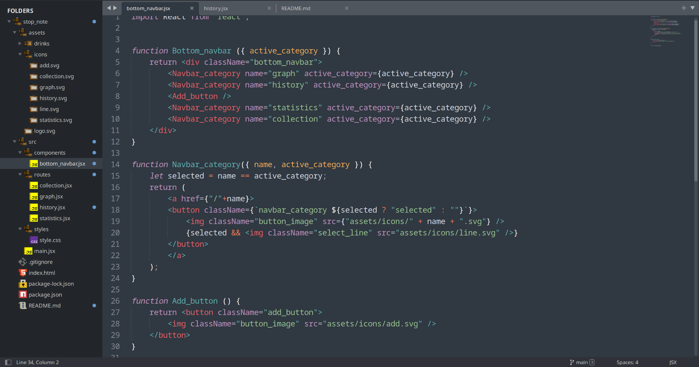
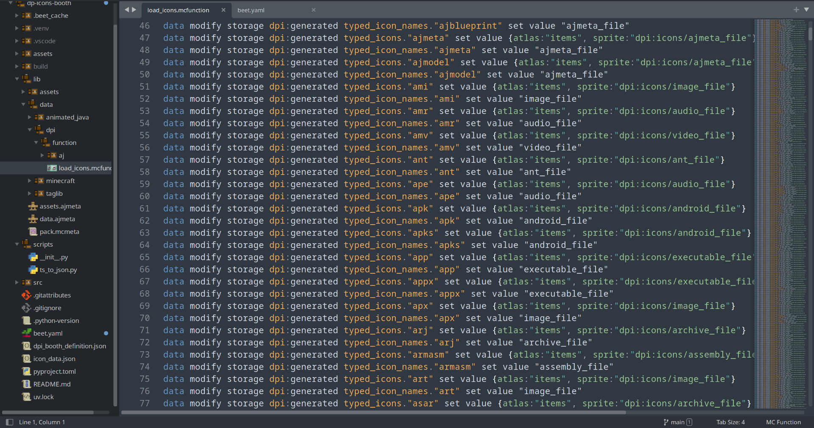

  

---

This is an official port of [Datapack Icons](https://marketplace.visualstudio.com/items?itemName=SuperAnt.mc-dp-icons) extension for Sublime Text.
Unfortunately Sublime Text packages are very limited when it comes to file icons themes, so the port lacks dynamic icon features that are present in main extension.
<h1>

Showcase

# Install

1. [Install Package Control](https://packagecontrol.io/installation) if it is not already present.
2. Open Command Palette (<kbd>Ctrl</kbd>+<kbd>Shift</kbd>+<kbd>P</kbd>)
3. Run `Package Control: Install Package` and search for `Datapack Icons`.
